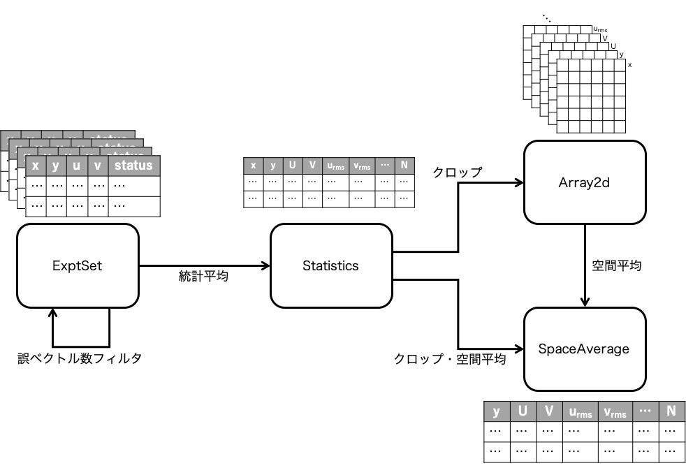

# Manual
- [ExptSet](#ExptSet)
- [Statistics](#Statistics)
- [Array2d](#Array2d)
- [SpaceAverage](#SpaceAverage)
- [Others](#Others)



## ExptSet
DynamicStudio から出力した瞬時データの集合．実際にはオブジェクト生成時に指定したディレクトリ内の瞬時データのファイル名のリストを取り扱っている．誤ベクトル数が特に多いデータを除外することができる．

### Instantiate
```python
expt = ds.model.ExptSet('directory')
```
- `directory`: 複数の瞬時データのファイル（csv 形式）が保存されているディレクトリ

### Fields
- instant_data_list
    - 瞬時データのファイル名のリスト

### Methods
- incorrect_vector_filter(filter_value)
    - `filter_value` よりも誤ベクトル数が多い瞬時データのファイル名を `instant_data_list` から除外する
- incorrect_vector_example(example_number)
    - `instant_data_list` に含まれる瞬時データのファイル名の最初から `example_number` で指定した数の瞬時データに含まれる誤ベクトル数を表示する
- join(instant_data_list_list)
    - `instant_data_list_list` に含まれる瞬時データのファイル名を `instant_data_list` に統合する

### Example
```python
import dynamicstorm as ds # モジュールインポート

expt = ds.model.ExptSet('directory') # オブジェクトの生成
expt.incorrect_vector_example(100) # 100 個のファイルの誤ベクトル数を確認
expt.incorrect_vector_filter(300) # 誤ベクトル数が 300 以上のデータを除外

expt2 = ds.model.ExptSet('directory2') # 別のオブジェクトの生成
expt.join(expt2.instant_data_list) # expt2 のデータを expt に統合

expt.instant_data_list # 表示

```


## Statistics
時間平均 (vector statistics) データ．DynamicStudio の形式を模擬して生成するため，DynamicStudio で統計 (analyse > vector statistics) したものと同じように扱うことができる．

### Instantiate
```python
stat = ds.model.Statistics(instant_data_list=instant_data_list)
# or
stat = ds.model.Statistics(source_file='directory/filename')
```
- `instant_data_list`: 瞬時データのファイル名が含まれるリスト
- `filename`: 保存済みの時間平均済みのデータのファイル名

オブジェクトの生成元となった瞬時データのファイル数が多い場合，オブジェクトの生成に時間がかかる．multiprocessing を用いているため，オブジェクト生成の進捗状況は外部ターミナルで表示する必要がある場合がある．

### Fields
- time_averaged_data_frame
    - pandas dataframe 形式の時間平均済みデータ．各データのラベルは DynamicStudio から出力したデータを模擬したものになっている．
    - 含まれるデータ:
        - x: x 座標
        - y: y 座標
        - U: x 方向平均速度
        - V: y 方向平均速度
        - u_rms: x 方向変動速度の二乗平均平方根 (root mean square)
        - v_rms: y 方向変動速度の二乗平均平方根 (root mean square)
        - uv: レイノルズ応力
        - uuu 
        - vvv 
        - uuv 
        - uvv 
        - N: 統計に用いたデータの内，誤ベクトルでなかったデータの数

### Methods
- save(filename)
    - 統計したデータを `filename` という名前のファイルに csv 形式で保存する
- join(time_averaged_data_frame or time_averaged_data_frame_list)
    - 時間平均データを統合する
    - 計測領域の座標に依らず統計を行ってしまうため，同じ領域を計測したデータの統合のみに利用すること

### Example
```python
import dynamicstorm as ds # モジュールインポート

# 瞬時データから時間平均データを生成
expt1 = ds.model.ExptSet('directory') # オブジェクトの生成
expt1.incorrect_vector_filter(300) # 誤ベクトル数が 300 以上のデータを除外
stat1 = ds.model.Statistics(instant_data_list=expt1.instant_data_list) # 時間平均

# 保存済みのファイルから時間平均データを生成
stat2 = ds.model.Statistics(source_file='directory/time_averaged_file02.csv')

# 2 つの時間平均データを統合
stat3 = ds.model.Statistics() # 空のオブジェクトの生成
stat3.join([stat1.time_averaged_data_frame, stat2.time_averaged_data_frame])
stat3.save('directory/time_averaged_file03.csv')

stat3.time_averaged_data_frame # 表示
```
## Array2d
時間平均済みデータから必要な範囲のみ取り出したデータを 2 次元配列にしたもの．

### Instantiate
```python
array = ds.model.Array2d(
            data_frame=time_averaged_data_frame,
            grid_shape=grid_shape,
            crop_range=crop_range,
            size=size)
```
- `data_frame`: pandas dataframe 形式の時間平均済みデータ
- `grid_shape`: PIV 時の Interrogation Window のグリッドサイズのリスト
    - `[y 方向のグリッドサイズ, x 方向のグリッドサイズ]`
- `crop_range`: クロップする流れ場の範囲の座標を表すリスト (mm)
    - `[x_min, x_max, y_min, y_max]`
    - 値の代わりに `''` を挿入するとその部分はクロップされない
        - 例: `['', '', y_min, y_max]`
- `size`: 取得する 2 次元配列の解像度
    - `[x_grid, y_grid]`

### Fields
- array_2d_dict
    - 2 次元配列が含まれる dict．
    - 含まれるデータ:
        - x: x 座標
        - y: y 座標
        - U: x 方向平均速度
        - V: y 方向平均速度
        - u_rms: x 方向変動速度の二乗平均平方根 (root mean square)
        - v_rms: y 方向変動速度の二乗平均平方根 (root mean square)
        - uv: レイノルズ応力
        - uuu 
        - vvv 
        - uuv 
        - uvv 
        - N: 統計に用いたデータの内，誤ベクトルでなかったデータの数
        
### Methods
- join(array_2d_dict or array_2d_dict_list)
    - 別々のデータを統合する

### Example
```python
# モジュールインポート
import dynamicstorm as ds 
import matplotlib.pyplot as plt

# 時間平均データを取得
stat1 = ds.model.Statistics(source_file='directory/time_averaged_file01.csv')
stat2 = ds.model.Statistics(source_file='directory/time_averaged_file02.csv')

# 2 次元配列として取得
grid_shape = [74, 101]
crop_range1 = [1.25, 51.25, 14.88, 64.88] # [x_min, x_max, y_min, y_max]
crop_range2 = [0.33, 50.33, 20.03, 70.03]
size = [80, 80]
dict1 = ds.model.Array2d(data_frame=stat1.time_averaged_data_frame,
                          grid_shape=grid_shape,
                          crop_range=crop_range1,
                          size=size)
dict2 = ds.model.Array2d(data_frame=stat2.time_averaged_data_frame,
                          grid_shape=grid_shape,
                          crop_range=crop_range2,
                          size=size)

# 2 つのデータを統計
dict3 = ds.model.Array2d()
dict3.join([dict1.array_2d_dict, dict2.array_2d_dict])

# U の描画
plt.imshow(dict3.array_2d_dict['U'])
plt.show()
```

## SpaceAverage
x 方向に空間平均したデータ．

### Instantiate
```python
space = ds.model.SpaceAverage(
            data_frame=time_averaged_data_frame,
            grid_shape=grid_shape,
            crop_range=crop_range)
# or
space = ds.model.SpaceAverage(
            source_file='directory/filename',
            grid_shape=grid_shape,
            crop_range=crop_range)
```
- `data_frame`: pandas dataframe 形式の時間平均済みデータ
- `source_file`: 保存済みの空間平均データのファイル名
- `grid_shape`: PIV 時の Interrogation Window のグリッドサイズのリスト
    - `[y 方向のグリッドサイズ, x 方向のグリッドサイズ]`
- `crop_range`: クロップする流れ場の範囲の座標を表すリスト (mm)
    - `[x_min, x_max, y_min, y_max]`
    - 値の代わりに `''` を挿入するとその部分はクロップされない
        - 例: `['', '', y_min, y_max]`


### Fields
- space_averaged_data_frame
    - pandas dataframe 形式の空間平均済みデータ．
    - 含まれるデータ:
        - x: x 座標
        - y: y 座標
        - U: x 方向平均速度
        - V: y 方向平均速度
        - u_rms: x 方向変動速度の二乗平均平方根 (root mean square)
        - v_rms: y 方向変動速度の二乗平均平方根 (root mean square)
        - uv: レイノルズ応力
        - uuu 
        - vvv 
        - uuv 
        - uvv 
        - N: 統計に用いたデータの内，誤ベクトルでなかったデータの数
        
### Methods
- save(filename)
    - 統計したデータを `filename` という名前のファイルに csv 形式で保存する
- join(space_averaged_data_frame)
    - 空間平均データを統合する
    
### Example
```python
import dynamicstorm as ds

grid_shape = [74, 101]
crop_range = [1.25, 51.25, 14.88, 64.88] # [x_min, x_max, y_min, y_max]

# 時間平均データからオブジェクトを生成
stat1 = ds.model.Statistics(source_file='time_averaged_file01.csv')
space1 = ds.model.SpaceAverage(
            data_frame=time_averaged_data_frame,
            grid_shape=grid_shape,
            crop_range=crop_range)

# 保存済みのファイルからオブジェクトを生成
space2 = ds.model.SpaceAverage(
            source_file='directory/space_averaged_file02.csv',
            grid_shape=grid_shape,
            crop_range=crop_range)

# 2 つの空間平均データを統合
space3 = ds.model.SpaceAverage() # 空のオブジェクトを生成
space3.join([space1.space_averaged_data_frame, space2.space_averaged_data_frame])
space3.save('directory/space_averaged_file03.csv')

space3.space_averaged_data_frame # 表示
```

## Others
- label_dict
    - DynamicStudio の出力ファイルからデータを読み出す際や，計算済みのデータをファイルに保存する際のテーブルのラベルを管理する dict．デフォルトと異なる場合はこの dict を変更した上でファイルの読み書きを行う．
    - デフォルトラベル:
        - x: x (mm)[mm]
        - y: y (mm)[mm]
        - U: U[m/s]
        - V: V[m/s]
        - u: Std dev (U)[m/s]
        - v: Std dev (V)[m/s]
        - uv: Covar (U
        - uuu: uuu
        - vvv: vvv
        - uuv: uuv
        - uvv: uvv
        - Status: Status
        - N: N
    - 変更方法:
    ```python
    import dynamicstorm as ds
    ds.label_dict['uv']['label'] = 'Cover(U,V)[(m/s)ﾂｲ]'
    ```
        
- get_crop_index(time_averaged_data_frame, grid_shape, crop_range)
    - クロップ範囲端のデータのインデックスを取得する
    - 例:
    ```python
    import dynamicstorm as ds
    x_min_index, x_max_index, y_min_index, y_max_index = ds.model.get_crop_index(stat.time_averaged_data_frame,
                                                                                 [74,101],
                                                                                 [1.25, 51.25, 14.88, 64.88])
    ```

